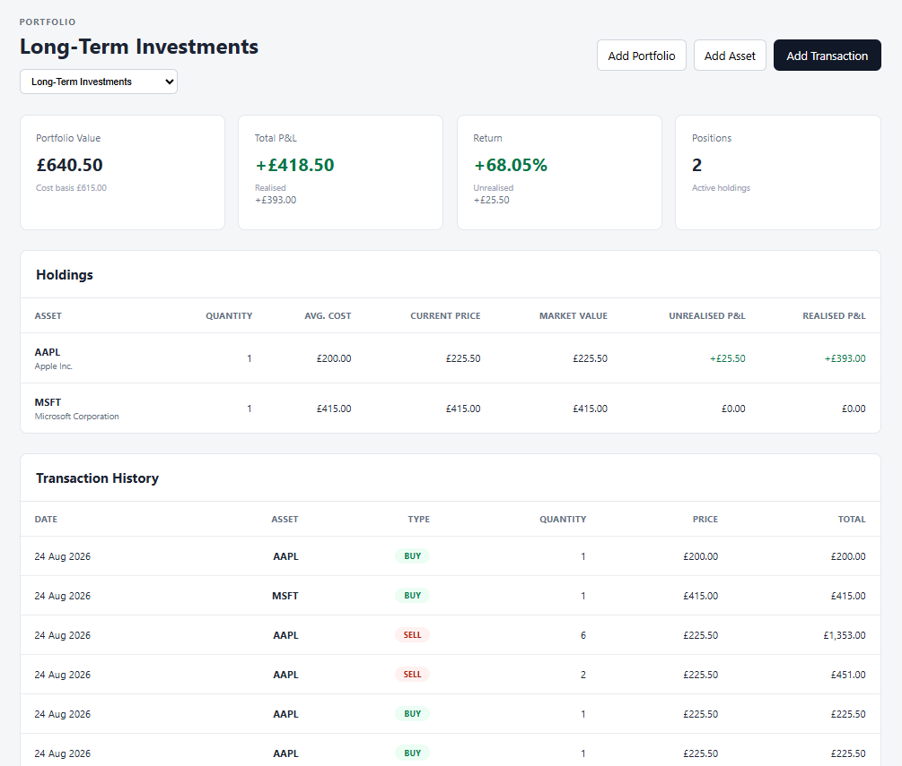

# Aurum

A full-stack investment portfolio tracking application built with **Java, Spring Boot, PostgreSQL and React**.

Aurum allows users to create investment portfolios, manage assets, record buy and sell transactions, and automatically calculate current holdings, cost basis, market value, and realised and unrealised profit/loss.

The project was built as a portfolio piece to demonstrate full-stack software engineering across REST API design, relational persistence, financial calculations, automated testing, containerisation, and continuous integration.

## Dashboard



## Features

- Create and manage multiple investment portfolios
- Create assets with a symbol, name and current market price
- Record BUY and SELL transactions
- Prevent sales that exceed the quantity currently held
- Calculate current positions from transaction history
- Calculate weighted average cost basis
- Calculate market value for each position
- Calculate realised and unrealised profit/loss
- Calculate portfolio-level value, P&L and percentage return
- View complete transaction history
- Switch between portfolios from the React dashboard
- Responsive dashboard with positive/negative P&L indicators
- Persistent PostgreSQL storage
- Automated backend testing
- Automated frontend linting and production builds
- Full-stack Docker Compose environment
- GitHub Actions continuous integration

## Tech Stack

### Backend

- Java 21
- Spring Boot
- Spring MVC
- Spring Data JPA
- Hibernate
- Maven
- JUnit
- Mockito

### Frontend

- React
- JavaScript
- Vite
- CSS
- ESLint

### Data & Infrastructure

- PostgreSQL
- Docker
- Docker Compose
- Nginx
- GitHub Actions

## Architecture

Aurum uses a conventional three-tier full-stack architecture:

```text
┌─────────────────────┐
│   React Frontend    │
│       Vite          │
└──────────┬──────────┘
           │ REST/JSON
           ▼
┌─────────────────────┐
│ Spring Boot Backend │
│                     │
│ Controllers         │
│ Services            │
│ Repositories        │
└──────────┬──────────┘
           │ JPA / Hibernate
           ▼
┌─────────────────────┐
│     PostgreSQL      │
└─────────────────────┘
```

The backend follows a layered structure:

```text
Controller
    ↓
Service
    ↓
Repository
    ↓
PostgreSQL
```

DTOs are used at the API boundary rather than exposing persistence entities directly, while service classes contain the application's business logic.

## Portfolio Calculations

Aurum derives portfolio positions from the transaction ledger rather than storing holdings independently.

For each asset, transactions are processed chronologically to determine the current quantity, weighted average cost, and realised profit/loss.

### Weighted Average Cost

When additional units are purchased:

```text
new average cost =
(existing cost basis + purchase cost)
/
new total quantity
```

### Unrealised Profit/Loss

```text
unrealised P&L =
current market value - remaining cost basis
```

### Realised Profit/Loss

When an asset is sold:

```text
realised P&L =
(sale price - average cost) × quantity sold
```

Aurum also validates SELL transactions against the existing transaction history so that a portfolio cannot sell more units of an asset than it currently owns.

## Running Aurum with Docker

The complete application can be started with Docker Compose.

### Requirements

- Docker
- Docker Compose

Clone the repository:

```bash
git clone https://github.com/LukeHenson-Baines/Aurum.git
cd Aurum
```

Build and start the application:

```bash
docker compose up --build
```

Docker Compose starts three services:

| Service | Purpose | Port |
| --- | --- | --- |
| `postgres` | PostgreSQL database | `5432` |
| `backend` | Spring Boot REST API | `8080` |
| `frontend` | React application served by Nginx | `5173` |

Once the containers are running, open:

```text
http://localhost:5173
```

The REST API is available at:

```text
http://localhost:8080/api
```

To stop the application:

```bash
docker compose down
```

The PostgreSQL database uses a persistent Docker volume, so portfolio data remains available when containers are stopped and restarted.

To deliberately remove the local database and start again with an empty instance:

```bash
docker compose down -v
```

> **Warning:** `-v` deletes the PostgreSQL Docker volume and therefore removes the locally stored Aurum data.

## Running Locally

The individual components can also be run outside the full Docker environment.

Start PostgreSQL first, then run the Spring Boot backend:

```bash
./mvnw spring-boot:run
```

On Windows:

```bash
mvnw.cmd spring-boot:run
```

Then start the React development server:

```bash
cd frontend
npm install
npm run dev
```

## Testing

### Backend

Run the backend test suite with:

```bash
./mvnw test
```

The backend tests use **JUnit and Mockito** to test application behaviour including portfolio, asset, transaction, holding, and summary logic.

Tests cover areas such as:

- Portfolio CRUD behaviour
- Asset management
- Transaction creation
- Missing portfolio and asset handling
- Prevention of insufficient SELL transactions
- Holding calculations
- Weighted average cost
- Realised and unrealised P&L
- Portfolio summary calculations

### Frontend

Run ESLint with:

```bash
cd frontend
npm run lint
```

Create a production build with:

```bash
npm run build
```

## Continuous Integration

Aurum uses **GitHub Actions** to validate every push and pull request to `main`.

The CI pipeline runs two independent jobs:

### Backend Tests

- Provisions PostgreSQL
- Configures Java 21
- Runs the Maven test suite

### Frontend Build

- Configures Node.js
- Installs dependencies with `npm ci`
- Runs ESLint
- Creates a production Vite build

This ensures changes to either side of the application are automatically validated before integration.

## Project Structure

```text
aurum/
├── .github/
│   └── workflows/
│       └── ci.yml
├── assets/
│   └── dashboard.png
├── frontend/
│   ├── src/
│   ├── Dockerfile
│   └── package.json
├── src/
│   ├── main/
│   │   ├── java/com/aurum/
│   │   │   ├── controller/
│   │   │   ├── dto/
│   │   │   ├── exception/
│   │   │   ├── model/
│   │   │   ├── repository/
│   │   │   └── service/
│   │   └── resources/
│   └── test/
├── Dockerfile
├── docker-compose.yml
├── pom.xml
└── README.md
```

## Future Development

Potential extensions include:

- Live market-price integrations
- Historical portfolio performance
- Portfolio allocation visualisations
- Authentication and user accounts
- Additional asset classes
- Cloud deployment